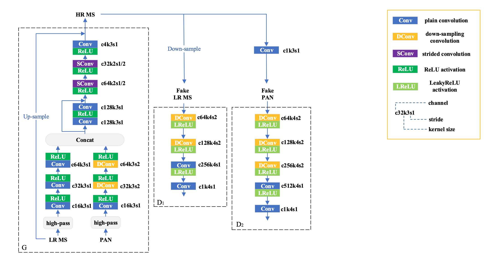

## PGMAN

This repo is the official implementation for [PGMAN: An Unsupervised Generative Multiadversarial Network for Pansharpening](https://arxiv.org/abs/2012.09054). 

The paper is accepted to J-STARS2021.

implemented in PyTorch1.1

python lib see in requirement.txt

### Architecture


### Raw Data

link: https://pan.baidu.com/s/190MywbwIlvONA_9-6-KMtQ 
code: u041 

link: https://pan.baidu.com/s/1dRrMH6KcFnkGuYZMCcJooA 
code: odg0

### Quick Start

First download the raw data, and then build the dataset. 
```
python data/handle_raw.py
python data/gen_dataset.py
```
It's suggested to check the corresponding path in the codes and make some modifications according to yourself before executing it.

The main pipeline is in the 'main.py', for a quick start, you can just run the 'run.py'. 
```
python run.py
```
It's suggested to check the corresponding params in 'run.py' and make some modifications according to yourself before executing it.


### Citing PGMAN
Consider cite PGMAN in your publications if it helps your research.

```
@ARTICLE{pgman,
  author={Zhou, Huanyu and Liu, Qingjie and Wang, Yunhong},
  journal={IEEE Journal of Selected Topics in Applied Earth Observations and Remote Sensing}, 
  title={PGMAN: An Unsupervised Generative Multiadversarial Network for Pansharpening}, 
  year={2021},
  volume={14},
  number={},
  pages={6316-6327},
}
```
